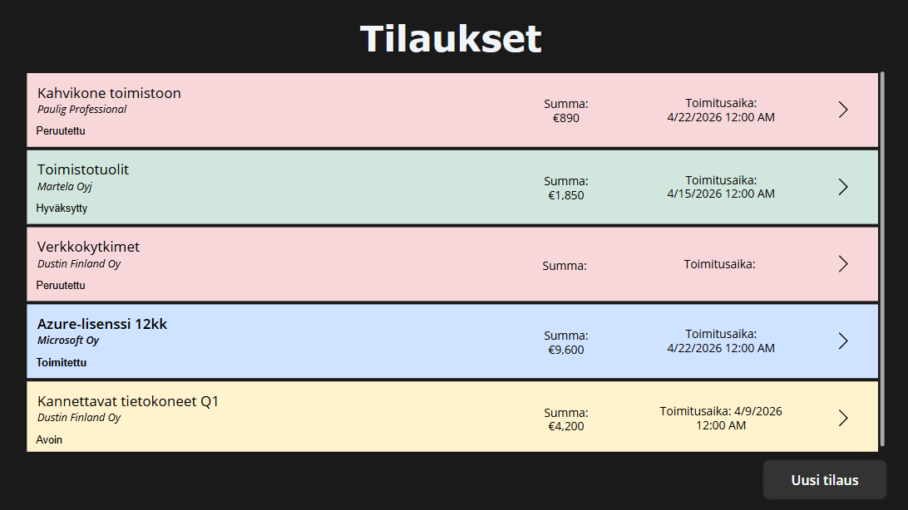
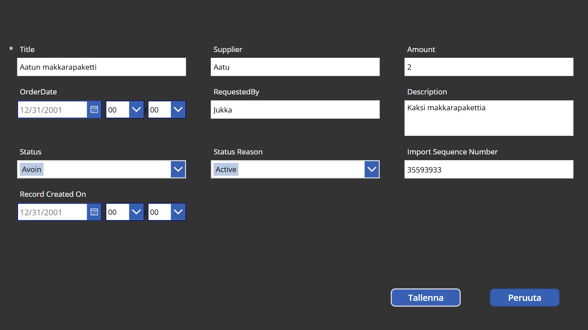
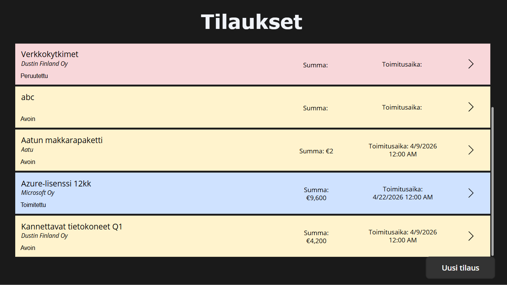
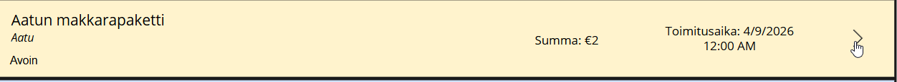
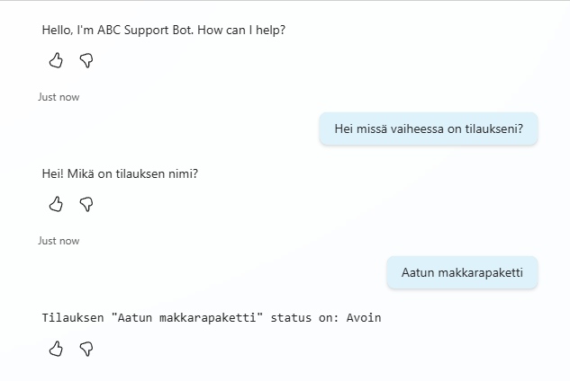
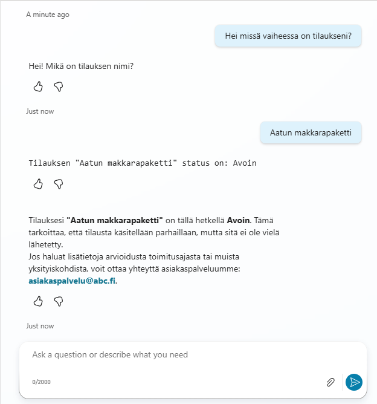

# Procurement Tracker – Power Platform Portfolio Project

A procurement management solution built with Microsoft Power Platform, demonstrating end-to-end order tracking, automated notifications, and AI-powered status lookup via chatbot.

---

## Solution Overview

| Component | Technology | Purpose |
|---|---|---|
| Canvas App | Power Apps | Create, view and edit purchase orders |
| Database | Microsoft Dataverse | Store and manage order data |
| Automation | Power Automate | Email notification on new orders |
| Chatbot | Copilot Studio | Query order status via natural language |

---

## Data Model (Dataverse)

**Table: PurchaseOrders**

| Column | Type | Description |
|---|---|---|
| Title | Text | Order name |
| Supplier | Text | Supplier company name |
| Amount | Currency | Order amount (€) |
| OrderDate | Date | Date of order |
| Status | Choice | Open / Approved / Delivered / Cancelled |
| Description | Multiline Text | Additional notes |
| RequestedBy | Text | Name of requester |

---

## Architecture

```
┌─────────────────────────────────────────────────────┐
│                  Power Apps Canvas App               │
│         (Create / View / Edit Purchase Orders)       │
└────────────────────────┬────────────────────────────┘
                         │ Read / Write
                         ▼
              ┌─────────────────────┐
              │  Microsoft Dataverse │
              │   (PurchaseOrders)   │
              └──────────┬──────────┘
                         │ Trigger: Row Added
                         ▼
              ┌─────────────────────┐
              │    Power Automate    │
              │  (Email Notification)│
              └─────────────────────┘

┌─────────────────────────────────────────────────────┐
│              Copilot Studio – Support Bot            │
│         "What is the status of order X?"            │
└────────────────────────┬────────────────────────────┘
                         │ Calls flow
                         ▼
              ┌─────────────────────┐
              │    Power Automate    │
              │   (GetOrderStatus)   │
              └──────────┬──────────┘
                         │ Query (filter by title)
                         ▼
              ┌─────────────────────┐
              │  Microsoft Dataverse │
              │   (PurchaseOrders)   │
              └─────────────────────┘
```

---

## Screenshots

**Order list** – All purchase orders displayed with color-coded status indicators. Each row shows the order name, supplier, amount, delivery date and current status at a glance.



**New order form** – A structured form for creating a new purchase order. All key fields are available including supplier, amount, delivery date and description.



**Order created** – The newly created order appears immediately in the list with the correct status color.



**Selecting an order** – Tapping any row navigates directly to the edit view for that order.



**Edit order** – All order details can be updated and saved back to Dataverse in real time.


**Copilot Studio – Order status topic** – The agent topic flow showing how a user query triggers a Power Automate call to Dataverse and returns the order status.


**Chatbot – Conversation start** – The user asks about their order status in natural language and the bot asks for the order name.



**Chatbot – Status response** – The bot retrieves the live status from Dataverse via Power Automate and responds with the result.



---

## How to Import

Download the `.zip` solution file from the Releases section, go to [make.powerapps.com](https://make.powerapps.com), navigate to **Solutions → Import solution** and follow the import wizard. Configure Dataverse and Outlook connections after import.

---

## Tech Stack

Power Apps, Microsoft Dataverse, Power Automate, Copilot Studio, Microsoft 365 Outlook.

---

Built as a portfolio project to demonstrate Power Platform skills for ERP-adjacent development roles. The solution simulates procurement workflows similar to those found in Dynamics 365 Finance & Operations implementations.
